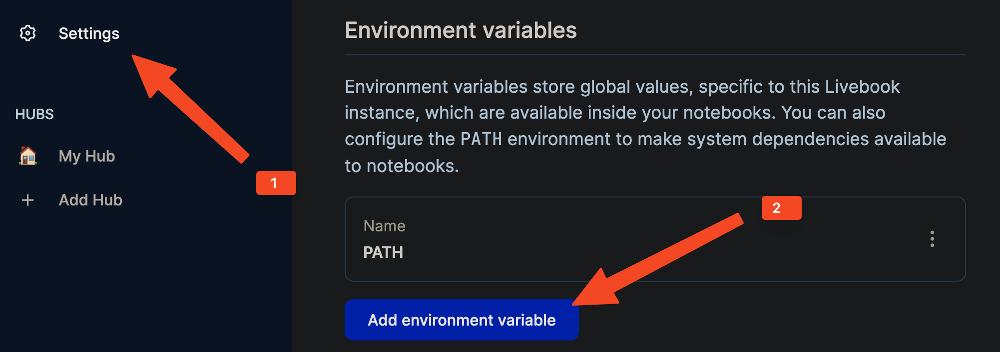

# Livebook examples 

This folder contains interactive livebook examples. To launch them you need to install livebook first.

## Installation

1. Install Livebook

    It is recommended to install Livebook via command line ([see official installation guide](https://github.com/livebook-dev/livebook#escript)). 

    If livebook was installed directly from the official page, one should add `$PATH` variable to the Livebook environment:
    