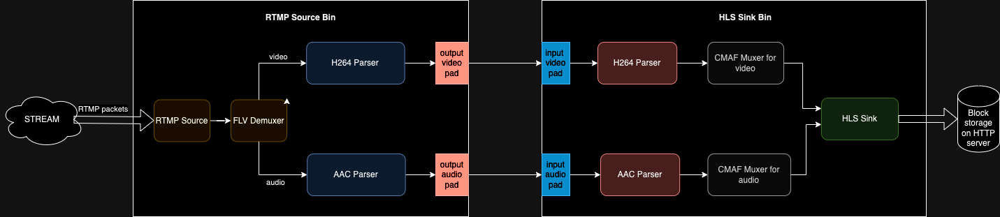

# RTMP to Adaptive Bitrate HLS

This demo is an application that is capable of receiving an RTMP stream, down-scaling it into multiple bitrate streams, then converting it to HLS, packaged as a [multi-variant](https://developer.apple.com/documentation/http-live-streaming/creating-a-multivariant-playlist) playlist. This demo also includes a web player that showcases adaptive track switching based on the viewer's current network throughput.

## Possible use cases

The application presented in this demo could be used in the following scenario.
There is one person, the so-called "streamer", and multiple "viewers", who want to see the stream of multimedia sent by the streamer. The streamer is expecting to interact live with their audience and wants everyone viewing to be as close to the 'live edge' as possible.
The streamer sends multimedia using RTMP, a protocol supported by popular streaming software (i.e. OBS). Such an RTMP stream is then converted into multi-variant HLS and published by the HTTP server, which is capable of handling many HTTP requests. The viewers can then play the multimedia delivered with HTTP. Such a solution scales well because the streamer doesn't have a direct connection with any of the viewers and the multi-variant playlist allows viewers with poor internet connection to avoid buffering by offering them smaller, low bitrate media.

## Architecture of the solution

The system is divided into two parts:

- the server, which is responsible for receiving the RTMP stream, copying and down-scaling the stream into multiple bitrates, packaging it into multi-variant HLS, and then publishing the created files with an HTTP server,
- the client, responsible for playing the incoming HLS stream and switching between the different bitrate tracks.

### Server

The internal architecture of the server is presented below:


### Client

The client is just a simple JavaScript application using the [Vidstack](https://www.vidstack.io/) web player.

## Running the demo

To run the demo, you'll need to have [Elixir installed](https://elixir-lang.org/install.html). Then, download the dependencies and start the server:

```shell
mix deps.get
mix phx.server
```

The server will be waiting for an RTMP stream on `localhost:9006`, and the client of the application will be available on `localhost:4000`.

## Exemplary stream generation with OBS

You can send RTMP stream onto `localhost:9006` with your favorite streaming tool. Below we present how to generate an RTMP stream with
[OBS](https://obsproject.com).
Once you have OBS installed, you can perform the following steps:

1. Open the OBS application
2. Open the `Settings` windows
3. Go to the `Stream` tab, set `Service` to `Custom...` and then set the value in the `Server` field to `rtmp://localhost:9006` (the address where the server is waiting for the stream)
4. Go to the `Output`, set output mode to `Advanced`, and set `Keyframe Interval` to 2 seconds.
5. Finally, you can go back to the main window and start streaming with the `Start Streaming` button.

Below you can see how to set the appropriate settings (steps 2. and 3. from the list of steps above):


## Copyright and License

Copyright 2018, [Software Mansion](https://swmansion.com/?utm_source=git&utm_medium=readme&utm_campaign=membrane)

[](https://swmansion.com/?utm_source=git&utm_medium=readme&utm_campaign=membrane)

Licensed under the [Apache License, Version 2.0](LICENSE)
