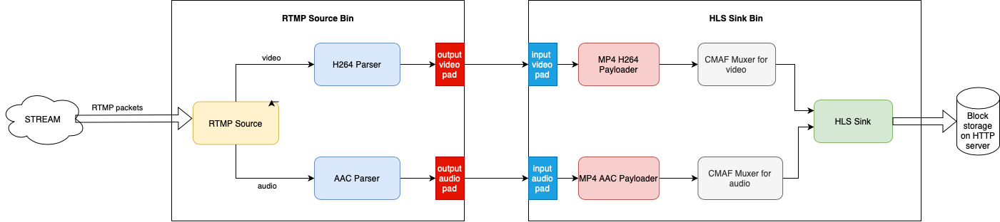

# RTMP to HLS 
This demo is an application which is capable of receiving RTMP stream, converting it to HLS and publishing via HTTP server, so that it can be played with a web player.

## Possible use cases
The application presented in this demo could be used in the following scenario.
There is one person, so called "streamer", and multiple "viewers", who want to see the stream of multimedia sent by the streamer.
The streamer sents multimedia with the use of RTMP as it is protocol supported by the streamer's streaming tool (i.e. OBS). Such a RTMP stream is then converted into HLS and published by the HTTP server, which is capable of handling many HTTP requests. The viewers can then play the multimedia stream by downloading the files from the server with the use of HTTP. Such a solution scales well since the streamer do not need to have a direct connection with each of the viewers.

## Architecture of the solution

The system is devided into two parts:
* the server, responsible for receiving RTMP stream, converting it into HLS and then publishing the created files as a HTTP server,
* the client, responsible for playing the incoming HLS stream.

### Server
The internal architecture of the server is presented below:



### Client
Client is just a simple javascript application, the [HLS.js](https://github.com/video-dev/hls.js/) web player.

## How to run the demo?
In order to run the demo, clone the membrane_demo repository and checkout to the demo directory:
```
git clone https://github.com/membraneframework/membrane_demo
cd membrane_demo/rtmp_to_hls
```

Then you need to download the dependencies of the mix project:
```
mix deps.get
```

Finally, you can start the phoenix server:
```
mix phx.server
```

The server will be waiting for RTMP stream on `localhost:9009`, and the client of the application will be available on `localhost:4000`.
### Running OBS
Here is an example on how to generate RTMP stream. It uses [OBS](https://obsproject.com).
Once you have OBS installed, you can perform the following steps:
1. Open the OBS application
2. Open the `Settings` windows
3. Go to the `Stream` tab and set the value in the `Server` field to: `rtmp://localhost:9009` (the address where the server is waiting for the stream)
4. Optionally you can go to the `Output` tab, under the `Stream` tab, set the `Output mode` to `Advanced`, and change the h264 `Profile` to the desired one 
5. Finally, you can go back to the main windows and start streaming with the `Start Streaming` button.
   
Below you can see how to set the appropriate settings (step 2), 3) and 4) from the list of steps above):


## Copyright and License

Copyright 2018, [Software Mansion](https://swmansion.com/?utm_source=git&utm_medium=readme&utm_campaign=membrane)

[](https://swmansion.com/?utm_source=git&utm_medium=readme&utm_campaign=membrane)

Licensed under the [Apache License, Version 2.0](LICENSE)