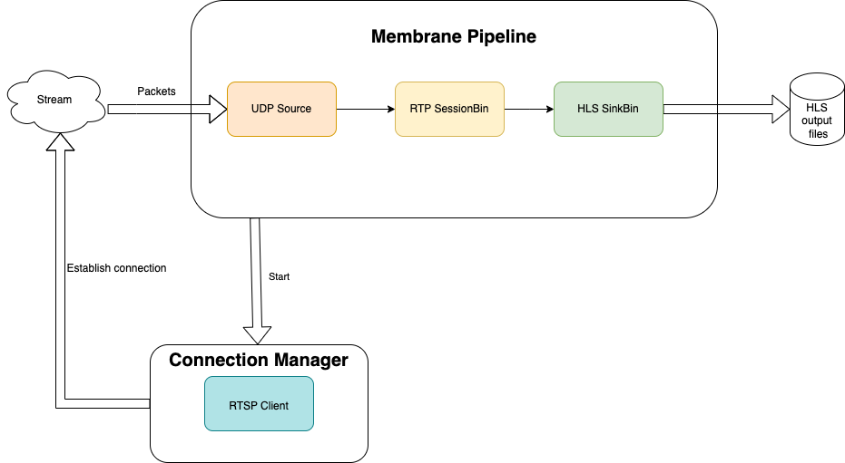

# RTSP to HLS converter demo

This demo demonstrates receiving the RTSP stream and converting it to the HLS stream.

## Components

The project consists of 2 parts:

- The pipeline, which converts the RTP stream to HLS
- Connection Manager, which is started by the pipeline and is responsible for establishing the RTSP connection

The internal architecture of an application is presented below:



## Prerequisites and running the demo

Below is the instruction for the installation of required dependencies and how to run this demo on various operating systems:

### Prerequisites
Make sure you have Elixir installed on your machine. For installation details, see: https://elixir-lang.org/install.html

### Running the demo

To run the demo, clone the `membrane_demo` repository and checkout to the demo directory:

```shell
git clone https://github.com/membraneframework/membrane_demo
cd membrane_demo/rtsp_to_hls
```

Then you need to download the dependencies of the mix project:

```shell
mix deps.get
```
You may be asked to install `Hex` and then `rebar3`.

### Running simple RTSP server
We will use a custom implementation of a simple RTSP server that you will be able to run with the `server.exs` script.
That script will setup a server listening for RTSP connection on `rtsp://localhost:8554`.

In order to run a server, type: 

```shell
mix run server.exs
```

### Running RTSP to HLS conversion
After you have launched the RTSP server, you can run the pipeline that performs RTSP to HLS conversion:

```shell
mix run rtsp_to_hls.exs
```

By default the pipeline is configured to connect to the RTSP server launched in the previous step of this manual. 
You can change the default pipeline configuration in the `rtsp_to_hls.exs` script implementation by modification of the following 
attributes:

##### rtsp_to_hls.exs

```elixir
@rtsp_stream_url "rtsp://localhost:8554/livestream"
@output_path "hls_output"
@rtp_port 20000
```

After a moment the pipeline will start generating HLS output files (by default in the `hls_output` directory).
To watch the stream we need to serve those files, e.g. by using python HTTP server:

```shell
cd hls_output
python3 -m http.server 8000
```

## Copyright and License

Copyright 2022, [Software Mansion](https://swmansion.com/?utm_source=git&utm_medium=readme&utm_campaign=membrane)

[](https://swmansion.com/?utm_source=git&utm_medium=readme&utm_campaign=membrane)

Licensed under the [Apache License, Version 2.0](LICENSE)
